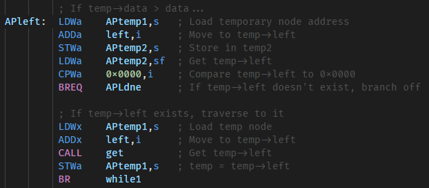

# Pep/9 Assembly Language Extension

Language support for the Pep/9 assembly language.

## Features

Adds basic language support for the Pep/9 assembly language used in the Computer Systems college course.

## Release Notes

### 1.1.0

Improved syntax matching.

### 1.0.0

Initial release of basic language support.
